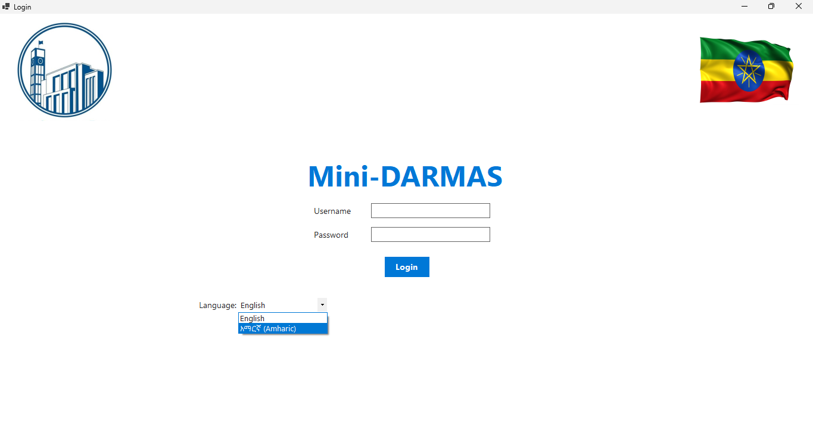
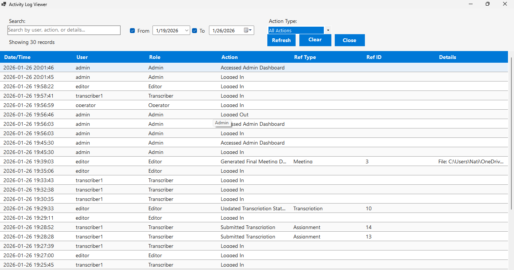
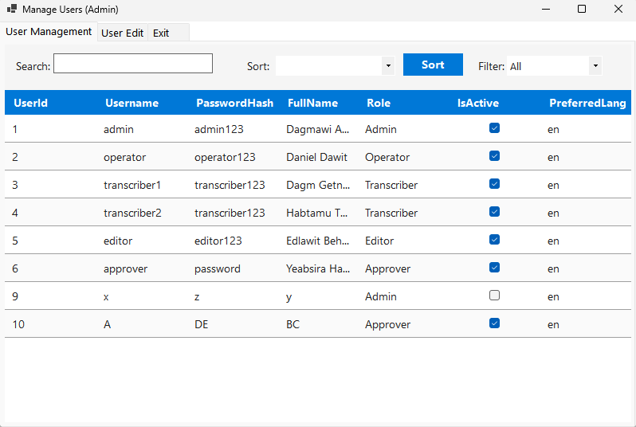
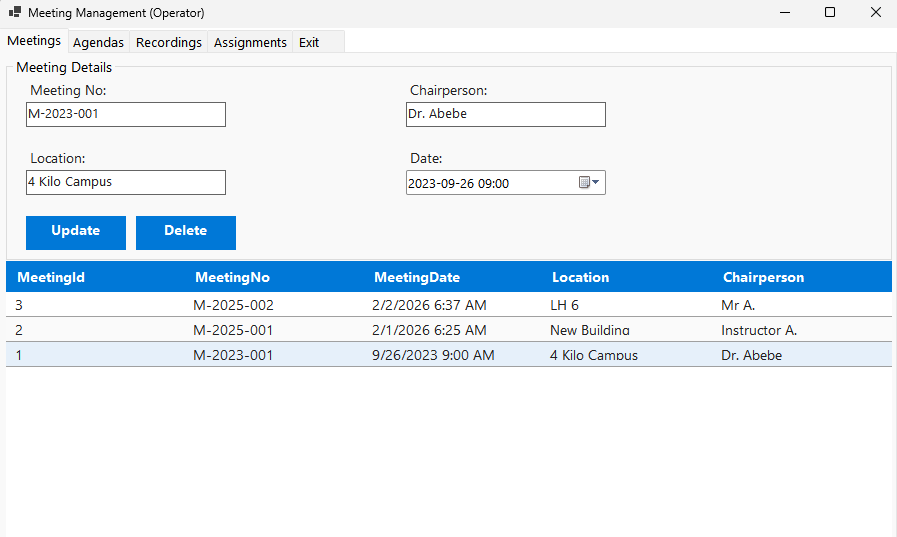
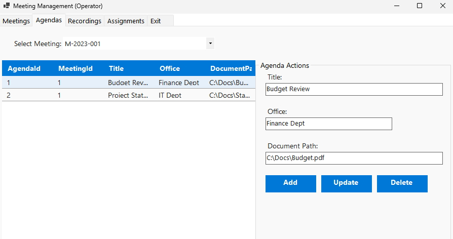
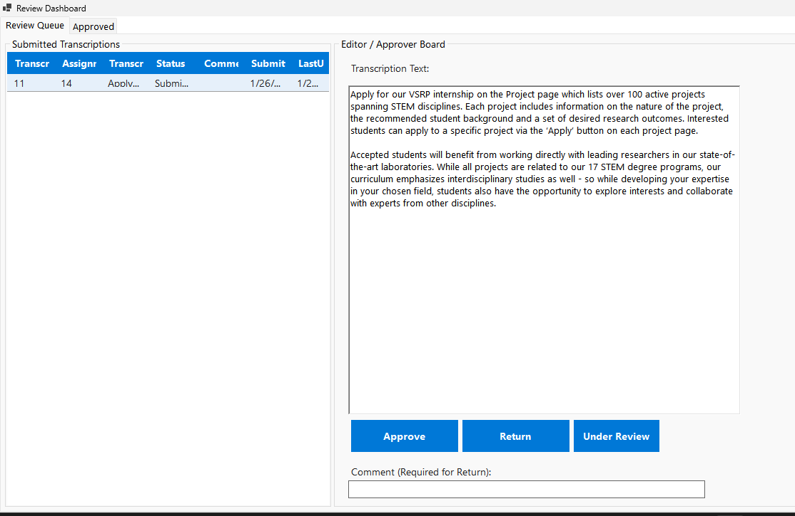

# Digital Meeting Management System

A WinForms-based meeting management and transcription system that supports recording, agenda tracking, role-based workflows, and official minutes generation.

---

## Table of contents

- [Features](#features)
- [Demo / Screenshots](#demo--screenshots)
- [Tech stack](#tech-stack)
- [Prerequisites](#prerequisites)
- [Installation](#installation)
- [Contributing](#contributing)
- [License](#license)
- [Contact](#contact)

---

## Features

### User & Security

- Role-based login and authentication (Admin, Operator, Transcriber, Editor, Approver)
- Secure database connection and session handling
- User management (create, edit, activate/deactivate users)
  
### Meeting Management
- Create, update, and delete meeting records
- Manage meeting details (meeting number, date, location, chairperson)
- View and search historical meetings
- Sort meetings using DataGridView headers
  
### Agenda Management
- Create and manage multiple agenda items per meeting
- Attach reference documents to agendas
- Edit and remove agenda items
- Assign agenda items to recordings and transcriptions

### Audio Recording & Playback

- Record live meeting audio segments
- Automatic time-based audio segmentation
- Store and manage audio file paths
- Integrated audio playback for transcribers
- Play, pause, stop, and seek audio recordings
  Transcription Management

### Assign audio recordings to transcribers

- Text-based transcription editor
- Track transcription progress and completion status
- Save draft and submit completed transcriptions
  
### Editorial Review & Approval

- Editor review of submitted transcriptions
- Make corrections and finalize text
- Approver validation and final approval
-  Track editorial and approval status

### Minutes of Meeting Generation

- Automatic compilation of approved transcriptions
- Generate formatted “Minutes of Meeting ” documents
- Preview and print final reports
- Insert digital signature placeholders
---

## Demo / Screenshots
- Login page
  
- Admin Dashboard  
  
- Activity Logs
- 
- User Managment Form
- 
- Manage meeting 
- 
- Manage Agenda
- 
- Transcriber Page
- 
- Editor Page
- 
- Meeting details / Minutes  
  

---

## Tech stack

- Frontend(Desktop UI): C# WinForms (.NET)
- Backend & Business Logic: C# (.NET)
- Database: Microsoft SQL Server 
- Data Access : ADO.NET (Microsoft.Data.SqlClient)
- Architecture & Patterns : MVC Architecture
---

## Prerequisites
- You can install this desktop application straight into your computer because it is user-ready released application software.

## Installation
---
## The installer package is located at: 
```bash
MiniDARMAS.Installer\bin\Release\MiniDARMAS.Installer.msi
```
- Download/Copy: Get the MiniDARMAS.Installer.msi file to the target computer.
- Run: Double-click the file to start the setup wizard.
- Install: Follow the on-screen instructions (Next > Install > Finish).
- Note: Since this is a self-signed installer, Windows might ask for confirmation. Click "Yes" or "Run anyway" if prompted.
- Launch: Look for "Digital Meeting Management System" on the Desktop or in the Start Menu.
-- 
--
## Contributing

Thank you for considering contributing! Please:

1. Fork the repository.
2. Create a feature branch: `git checkout -b feature/my-feature`
3. Commit your changes: `git commit -m "Add my feature"`
4. Push to your branch: `git push origin feature/my-feature`
5. Open a Pull Request describing your changes.

Include coding style, linting, and testing requirements (e.g., run linters and tests before submitting PR).

---
## License

This project is licensed under the [MIT License](LICENSE) 

---

## Contact

Project maintainer: Dagmawi Antehun 
Email: natymiskir@gmail.com
Repository: https://github.com/ethio-man/Digital-Meeting-Management-System
